HDDModelDecoder.py [](https://unlicense.org/)
===============
~~~~
~~~~
[](https://libraries.io/github/KOLANICH-ML/HDDModelDecoder.py)
[](https://codeberg.org/KOLANICH-tools/antiflash.py)



**We have moved to https://codeberg.org/KOLANICH-ML/HDDModelDecoder.py, grab new versions there.**

Under the disguise of "better security" Micro$oft-owned GitHub has [discriminated users of 1FA passwords](https://github.blog/2023-03-09-raising-the-bar-for-software-security-github-2fa-begins-march-13/) while having commercial interest in success and wide adoption of [FIDO 1FA specifications](https://fidoalliance.org/specifications/download/) and [Windows Hello implementation](https://support.microsoft.com/en-us/windows/passkeys-in-windows-301c8944-5ea2-452b-9886-97e4d2ef4422) which [it promotes as a replacement for passwords](https://github.blog/2023-07-12-introducing-passwordless-authentication-on-github-com/). It will result in dire consequencies and is competely inacceptable, [read why](https://codeberg.org/KOLANICH/Fuck-GuanTEEnomo).

If you don't want to participate in harming yourself, it is recommended to follow the lead and migrate somewhere away of GitHub and Micro$oft. Here is [the list of alternatives and rationales to do it](https://github.com/orgs/community/discussions/49869). If they delete the discussion, there are certain well-known places where you can get a copy of it. [Read why you should also leave GitHub](https://codeberg.org/KOLANICH/Fuck-GuanTEEnomo).

---

wheels:
* ~~[using XGBoost for ML](https://gitlab.com/KOLANICH-ML/HDDModelDecoder.py/-/jobs/artifacts/master/raw/wheels/HDDModelDecoder-CI_xgboost-py3-none-any.whl?job=build)~~ (works without XGBoost, but ML-based predictions are unavailable)
* ~~[pure python](https://gitlab.com/KOLANICH/HDDModelDecoder.py/-/jobs/artifacts/master/raw/wheels/HDDModelDecoder-CI_python-py3-none-any.whl?job=build)~~ - not very implemented yet.


Decodes info hidden in HDD model names.

```python
print(HDDModelDecoder.decodeModel("ST4000DM004")) # {'vendor': 'Seagate', 'capacity': 4000, 'segment': 'Mainstream', 'attributes': '004'}
print(HDDModelDecoder.decodeModel("ST1000VX000")) # {'vendor': 'Seagate', 'capacity': 1000, 'segment': 'Surveillance', 'attributes': '000'}
print(HDDModelDecoder.decodeModel("ST500LM030")) # {'vendor': 'Seagate', 'capacity': 500, 'segment': 'Laptop Mainstream', 'attributes': '030'}
print(HDDModelDecoder.decodeModel("ST4000DM005")) # {'vendor': 'Seagate', 'capacity': 4000, 'segment': 'Mainstream', 'attributes': '005'}
print(HDDModelDecoder.decodeModel("ST95005620AS")) # {'vendor': 'Seagate', 'form_factor': {'form_factor': 2.5, 'height': 0.748}, 'capacity': 5005.62 (WRONG!), 'interface': 'SATA'}

print(HDDModelDecoder.decodeModel("HDN724040ALE640")) # {'vendor': 'HGST', 'family': 'Deskstar', 'series': 'NAS', 'rpm': 7200, 'top_capacity': 4000, 'capacity': 4000, 'generation_code': 'A', 'height': 1, 'interface': {'interface': 'SATA', 'speed': 6}, 'feature_code': '4', 'buffer_size': 64, 'data_security_mode': 'Instant Secure Erase'}
print(HDDModelDecoder.decodeModel("HDN724030ALE640")) # {'vendor': 'HGST', 'family': 'Deskstar', 'series': 'NAS', 'rpm': 7200, 'top_capacity': 4000, 'capacity': 3000, 'generation_code': 'A', 'height': 1, 'interface': {'interface': 'SATA', 'speed': 6}, 'feature_code': '4', 'buffer_size': 64, 'data_security_mode': 'Instant Secure Erase'}
print(HDDModelDecoder.decodeModel("HTS721010A9E630")) # {'vendor': 'HGST', 'family': 'Travelstar', 'series': 'Standard', 'rpm': 7200, 'top_capacity': 1000, 'capacity': 1000, 'generation_code': 'A', 'height': 0.374, 'interface': {'interface': 'SATA', 'speed': 6}, 'feature_code': '3', 'buffer_size': 32, 'data_security_mode': 'Instant Secure Erase'}
print(HDDModelDecoder.decodeModel("HTE721010A9E630")) # {'vendor': 'HGST', 'family': 'Travelstar', 'series': 'Enhanced Availability', 'rpm': 7200, 'top_capacity': 1000, 'capacity': 1000, 'generation_code': 'A', 'height': 0.374, 'interface': {'interface': 'SATA', 'speed': 6}, 'feature_code': '3', 'buffer_size': 32, 'data_security_mode': 'Instant Secure Erase'}
print(HDDModelDecoder.decodeModel("HUS726060ALE614")) # {'vendor': 'HGST', 'family': 'Ultrastar', 'series': 'Standard', 'rpm': 7200, 'top_capacity': 6000, 'capacity': 6000, 'generation_code': 'A', 'height': 1, 'interface': {'interface': 'SATA', 'speed': 6}, 'feature_code': '1', 'data_security_mode': 'Secure Erase (overwrite only)'}
print(HDDModelDecoder.decodeModel("HDP725025GLA380")) # {'vendor': 'HGST', 'family': 'Deskstar', 'series': 'P Series', 'rpm': 7200, 'top_capacity': 5000, 'capacity': 2500, 'generation_code': 'G', 'height': 1, 'interface': {'interface': 'SATA', 'speed': 3}, 'feature_code': '8', 'buffer_size': 8, 'data_security_mode': 'Instant Secure Erase'}
```

Sources of information
----------------------
* [HGST Datasheets](https://www.google.com/search?q=inurl%3Ahttps%3A%2F%2Fwww.hgst.com%2Fsites%2Fdefault%2Ffiles%2Fresources%2F+filetype%3Apdf+%22How+to+read%22+%22model+number%22)
* WD Manuals: [Model Number Format for OEM and Distribution Channels](https://www.wdc.com/wdproducts/library/Flyer/ENG/2579-001028.pdf) and [Legacy Model and Order Numbers](https://products.wdc.com/library/other/2579-701261.pdf)
* [Toshiba website](https://toshiba.semicon-storage.com/ap-en/design-support/partnumber/storage-products.html)
* ["Understanding Hard Drive Model Numbers" forum post](https://hardforum.com/threads/understanding-hard-drive-model-numbers.921544/)
* ["Western Digital hard drives - deciphering the extended model #" forum post](http://forums.storagereview.com/index.php?/topic/22131-western-digital-hard-drives-deciphering-the-extended-model/)
* [Samsung datasheets](https://www.google.com/search?q=inurl%3Ahttps%3A%2F%2Fwww.seagate.com%2F+samsung+datasheet+filetype%3Apdf) and [Product selection guides](https://www.google.com/search?q=site%3Asamsung.com+AND+%22product+selection+guide%22+AND+filetype%3Apdf+AND+7200)

Dependencies
------------
* **Optionally** [`xgboost`](https://github.com/dmlc/xgboost)  [](https://pypi.python.org/pypi/xgboost) [](https://travis-ci.org/dmlc/xgboost) [](https://libraries.io/github/dmlc/xgboost) [](https://gitter.im/dmlc/xgboost), if you want non-HGST WD drives series.


Building
--------
For building with ML you will also need

* [`pandas`](https://github.com/pandas-dev/pandas)  [](https://pypi.python.org/pypi/pandas) [](https://codecov.io/github/pandas-dev/pandas/) [](https://libraries.io/github/pandas-dev/pandas)

* [`Chassis.py`](https://codeberg.org/KOLANICH-ML/Chassis.py)  [](https://pypi.python.org/pypi/Chassis.py)
[](https://libraries.io/github/KOLANICH/Chassis.py)

